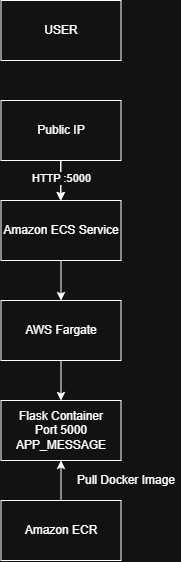

# Containerized Flask Application on AWS

A Python Flask web application containerized using Docker and deployed on Amazon ECS with AWS Fargate. The Docker image is stored in Amazon ECR.

## Architecture


```text
                    USER
                      |
                      | HTTP :5000
                      v
              Public IP Address
                      |
                      v
             Amazon ECS Service
                      |
                      v
                AWS Fargate
                      |
                      v
              Docker Container
                      |
                      v
             Flask Application


        Docker Image
             |
             v
        Amazon ECR
Technologies Used
Python
Flask
Docker
Amazon ECR
Amazon ECS
AWS Fargate
Amazon VPC
Security Groups
Project Features
Flask web application
Docker containerization
Environment variable configuration
Health-check endpoint
Docker image stored in Amazon ECR
Deployment using Amazon ECS Fargate
Public access through a Fargate task
Application Endpoints
Home Page
http://YOUR-PUBLIC-IP:5000
Health Check
http://YOUR-PUBLIC-IP:5000/health

Expected response:

{
  "status": "healthy"
}
Environment Variable

The application supports the following environment variable:

APP_MESSAGE

Example:

APP_MESSAGE="Hello from Amazon ECS Fargate!"
Local Docker Setup
Build Docker Image
docker build -t flask-ecs-app .
Run Container
docker run -d -p 5000:5000 -e APP_MESSAGE="Hello from Docker!" --name flask-container flask-ecs-app
Test

Open:

http://localhost:5000

Health check:

http://localhost:5000/health
Amazon ECR

The Docker image was pushed to a private Amazon ECR repository.

Repository:

containerized-flask-app

Image:

containerized-flask-app:latest
Amazon ECS Configuration
Setting	Value
Cluster	flask-application-cluster
Service	flask-app-service
Task Definition	flask-app-task
Launch Type	AWS Fargate
CPU	0.25 vCPU
Memory	512 MiB
Container	flask-container
Container Port	5000
Desired Tasks	1
Deployment Process

The application was deployed using the following workflow:

Flask Application
       |
       v
    Docker
       |
       v
Docker Image
       |
       v
 Amazon ECR
       |
       v
 Amazon ECS
       |
       v
 AWS Fargate
       |
       v
Running Flask Container
Screenshots

Screenshots of the application and AWS deployment are available in the screenshots directory.

Project Outcome

The Flask application was successfully containerized using Docker, stored in Amazon ECR, and deployed using Amazon ECS with AWS Fargate.

The application was tested successfully using both the main application endpoint and the /health endpoint.

Security Note

AWS credentials and secret keys are not included in this repository.

The project uses a .gitignore file to prevent sensitive files and local development files from being committed.